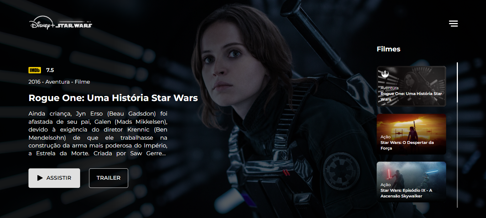

<h1 align="center">
  Recriação da Interface do Disney Plus na Temática Star Wars
</h1>

  

## 🖥 Descrição do Projeto

Este projeto é uma recriação da interface da **Disney Plus na temática de Star Wars**, nele é utilizado _HTML_, _CSS_, _JavaScript_ e a _API_ da [**TMDB**](https://www.themoviedb.org/documentation/api), onde é fornecido todos os dados dos filmes.

Nele foi utilizado um protótipo do [**Itai Bracha**](https://www.figma.com/@itaibracha), e um tutorial do [**Leo Vargas**](https://www.youtube.com/c/LeoVargas) como base.

## ⌨️ Tecnologias Utilizadas

- HTML
- CSS
- JavaScript
- Responsive Design
- API da [**TMDB**](https://www.themoviedb.org/documentation/api)
