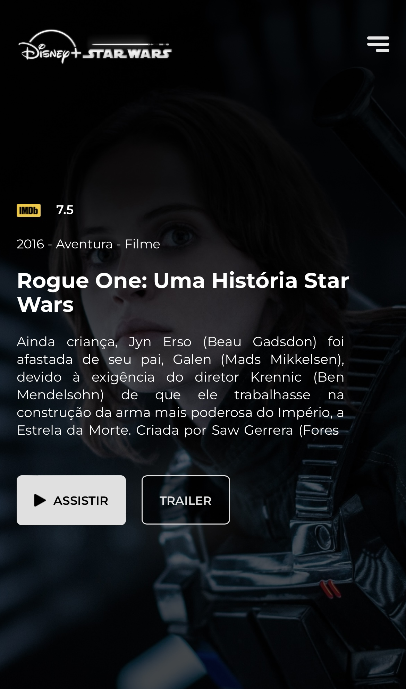

<h1 align="center">
  Recreation of the Disney+ Interface in a Star Wars Theme with Responsive Design
</h1> 

  
  

 

## 🖥 Project Description

This project is a recreation of the **Disney+ interface in the Star Wars theme**, using _HTML_, _CSS_, _JavaScript_ and the _API_ from [**TMDB**](https://www.themoviedb.org/documentation/api), where all movie data is provided.

It used a prototype from [**Itai Bracha**](https://www.figma.com/@itaibracha), and a tutorial from [**Leo Vargas**](https://github.com/leovargasdev) as a base.

## ⌨️ Technologies Used

- HTML
- CSS
- JavaScript
- Responsive Design
- [**TMDB**](https://www.themoviedb.org/documentation/api) API.
